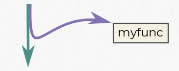
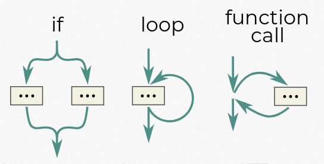
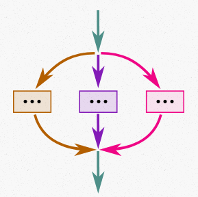

% Structured Concurrency
% Jonathan Hartley
% September 2019

## Being a summary of

Nathaniel J. Smith's blog post

[_Notes on Structured Concurrency_, or _Go Statement Considered Harmful_.](https://vorpus.org/blog/notes-on-structured-concurrency-or-go-statement-considered-harmful/)


## Existing concurrency mechanisms

Spawn a concurrent thread, e.g:

``` go
go myfunc();  // Golang
```

``` python
threading.Thread(target=myfunc()).start()  # Python, OS threads

asyncio.create_task(myfunc())  # or using asyncio
```

::: notes

The Python syntax is pretty fugly, while the Golang syntax is lovely,

:::

Language notation varies, but are all semantically equivalent.

## Alternatively

Use callbacks, e.g:

``` javascript
document.getElementById("myid").onclick = myfunc  // Javascript

promise.then(myfunc, errorhandler)  // Javascript using Promises
```

``` python
future.add_done_callback(myfunc)  # Python with asyncio
```

`myfunc` is called if and when an event occurs, rather than immediately.

::: notes

These are equivalent to starting a background thread
that blocks until an event, and then runs the callback.
(though the implementations differ.)

So for this conversation, these are semantically interchangeable with the
examples on the previous slide.

Futures and promises are the same too.

These schedule work to happen in the background,
giving a handle to optionally join the thread later.
This is just like spawning a thread.

Then you register callbacks on the handle.
As just described, this is equivalent to scheduling a thread.

:::

## Trio

``` python
async with trio.open_nursery() as nursery:
    nursery.start_soon(myfunc)
    nursery.start_soon(anotherfunc)
```

* Quirky?
* Restrictive?
* High level?

::: notes

When people first see this, they think it's weird and confusing.
It doesn't look like any of the existing approaches.
* Why is there this indented scope?
* What is the nursery object for?
* Why is it needed before I can spawn tasks?

Then people realize that it prevents patterns they are used to in other
frameworks, and they get annoyed. This seems quirky and restrictive and too
high level to be a basic primitive.

The goal of this post is to convince you that this isn't a quirky high level
construction, but that nurseries are as fundamental as 'for' loops or function
calls, and this style of concurrency should replace *all* of the previous
approaches to concurrency.

Sounds unlikely. But something very similar has happened before, and
examining that turns out to be instructive.

:::

## What is a 'goto' statement, anyway?

#######  {.fragment}

::: notes

Goto allows for two types of control flow:

* 'Sequential', the normal state of affairs,
  where statements execute one after the other, or
* 'goto', where control jumps to another arbitrary point.

Early languages had no `if` statements, loops or function calls.

These were all written manually, using `goto` and conditional `goto`s.

:::

## If x == 10 ... else ...

``` Makefile
            cmp 10, d0      # compare d0 to 10
            jne isfalse     # jump, if not equal, to 'isfalse'
                            # falls through to 'istrue'

istrue:     ...             # the 'is true' branch
            jmp end         # unconditional jump

isfalse:    ...             # the 'else' branch
                            # falls through to 'end'

end:        ...             # rest of code

```

::: notes

I'm showing this example using an assembly-like pseudo code,
but this sort of construct was common in higher level languages at
the time, too. (It's just I don't know any of them)

:::

## Loop 5 times:

``` Makefile
        load 5, d0      # iterate 5 times
start:  ...             # loop body
        ...
        dbne d0, start  # decrement d0 and branch to 'start'
                        # if not equal to zero
```

::: notes

The foreshadowing here, is that implementing our flow control manually like
this is much more flexible and powerful than using a 'for' loop. It is easy
to use the above technique to write valid code in which two loops aren't just
nested, but instead "partially overlap". i.e. the second loop starts within
the first loop, but ends outside of it, after the first loop has completed.
This is a structure that is very difficult to replicate using conventional
'for' loops, and is also very difficult to reason about. How many times will
a given bit of code be executed? It's very tricky to tell.

:::

## All control flow

::: notes

So `goto` was used for *all* control flow. Which is weird to think about
nowadays.

And the reason it's weird to think about is because
this is absolutely no longer the case.

Most languages don't have a `goto` any more.

Some languages have a statement that looks like `goto`,
but it's much weaker than the original.

For example, C#'s `goto` only allows
jumping to a label within the current function.

But even this weak version is almost entirely unused.
It has been replaced by other, higher-level constructs.

So what happened? And what can this teach us about concurrency?

:::

## What is a 'go' statement, anyway?

::: notes

To establish what 'goto' has to teach us,
let's consider what a 'go' statement really is.

:::
#######  {.fragment}
::: notes

The two colors indicate that _both_ paths are taken.

The parent thread operates sequentially, coming in at the top and leaving at
the bottom.

The child goes off to the 'myfunc' function. But unlike a regular function
call, this call is one-way. When myfunc ends, it does not return control here,
to its caller.

We can bring that outgoing arrow back again, to return control to
the parent thread, by joining on it. But this is a strictly optional
operation, and much concurrency code in existence today does not do it.

:::
####### Not just 'go' statement - all concurrency. {.fragment}
::: notes

We use 'go' statement as our example
because it's a particularly pure example of the form.
But this applies to all current concurrency primitives.

Notice the similarity between the lavender line
and our earlier diagram of the 'goto' statement.

They do differ, since 'go' is calling a function,
not an arbitrary place in the code.

But since myfunc does not return control to its caller,
that distinction is fairly minor.

Concurrent programs are notoriously difficult to reason about.
So are 'goto' based programs.

Is it possible that this might be for the same reasons?

In modern languages, the problems with 'goto' are largely solved.
If we study how they were fixed,
will it teach us how to make a more usable concurrency API?

:::

## What happened to goto?

::: notes
What is it about 'goto' that caused problems?

In the 1960s, Edsger Dijkstra wrote a pair of now famous papers that helped
to make this much clearer.
:::

Edsger W Dijkstra, late 1960s, wrote:

* Go to statement considered harmful
* Notes on structured programming

####### `goto` destroys abstraction. {.fragment}

## Algol




::: notes

Algol still had sequential control flow and goto,
but also had 'if' statements, loops, and function calls.

You could still implement these higher-level constructs using goto,
if you liked, and early on, that was how people thought of these.
As a convenient shorthand.

But Dijkstra pointed out that 'goto' is different.

For all the others, control flow comes in at the top,
and goes out at the bottom.

If we don't care about the details of what the code is doing,
this is nice, because we can basically ignore those details.

Some code is running, and it may run an 'if' or a loop or a function,
but after a while control will exit at the bottom,
and we can carry on with our program
just as if the code had been sequential instructions.

Even nicer, this property is preserved when these constructs are nested.
So loops can call a functions, which can contain 'if' statements,
and eventually control flow still drops out at the bottom, just like always.

So when I look at some code like:

:::
## An abstraction

``` python
print('hello world')
```
::: notes

I don't have to go read the big, complicated definition of `print`,
to reassure myself about the details of that operation,
such as string formatting, buffering, cross-platform differences,
just to reassure myself that control flow will return to me.
I know it will.
This makes 'print' a useful abstraction.

This might seem obvious.
But in a language containing 'goto', which can jump anywhere, at any time,
then none of these control structures are black boxes any more.

We might call a function, containing a loop, containing an 'if' statement,
and inside there is a `goto`, which can send control anywhere it wants.
Maybe control will return suddenly from another function entirely,
one we haven't even called yet. There's no way to know.

And this breaks abstraction.
It means that every function call is potentially a `goto` in disguise,
and the only way to know is to check the entire system's source code.
As soon as `goto` is in the language,
you stop being able to do local reasoning about flow control.

That's precisely _why_ goto leads to spaghetti code that's hard to understand.

:::

## Discipline

::: notes

And it's not good enough to say that we'll make sure that doesn't happen,
because we are good software engineers,
and we'll only use `goto` in responsible ways,
that don't break this expectation.

Because we have not just be sure about our own code,
but also anyone else's code that we build on top of.

So we'll have to check every last line of all of our transitive dependencies.
And this is an impossibly large task just to be able to trust our 'print'
function.

:::

## Solution

Not even once.

::: notes

So the only practical way to be sure about this
is to enforce it at the language level.
Which means removing 'goto' from languages entirely.

Which, clearly, is what has happened.

And in its place, we now regard the 'higher level' control flow statements,
such as functions and loops and conditionals, as our primitives.

From 2019, this all seems obvious and inevitable.
But in 1969, this was incredibly controversial.

Experts on writing code with `goto` understandably
resented having to relearn how to program
using the newer, more constraining constructs.
And it required building a while new set of languages.

But despite these problems,
the benefits were great enough that this is what has happened.

:::

## Surprise benefits

Resource cleanup

``` python
with open('filename') as handle:
    # use 'handle'
```

::: notes

'handle' is automatically closed
when we exit the indented scope.
Regardless of whether we exit normally,
or due to an exception.

The author of this code
doesn't have to remember anything.
It's handled automatically.

Other languages have equivalents, such as RAII, `using`, try-with-resource,
`defer`)

All of these assume that control flows in an orderly, structured way.

If we used `goto` to jump into the middle of our `with` block,
it's not at all clear what that should do.
Is the file open or not?

What if we jumped out again, instead of exiting normally?
Would the file get closed?

This feature just doesn't work in any coherent way
if your language has `goto` in it.

:::

## Surprise benefit

Error handling

``` python
try:
    print(output, file=myfile)
except BrokenPipeError:
    ...
```

::: notes

Many modern languages have mechanisms like exceptions to help with the
propagation of errors.

Outliers, like Rust and Go, that do not use exceptions,
still rely on propagating errors back up the call stack manually.

Both these approaches only make sense if you _have_ a call stack,
and a reliable concept of a function's caller.

With `goto` in the language, none of this is possible.

How does this relate to 'go' statements?
It turns out they are shockingly similar.

:::

## Go statements break abstraction.

::: notes

`Go` statements also break abstraction.

Just like a `goto`, any function call might be a `go` in disguise.

The function might seem to return,
but is part of it still running in the background?
There is no way to know without reading all its source code, transitively.

When will it finish? Hard to say.

If you have `go` statements, functions are no longer black-boxes.

This turns out to be the root cause of many common, real-world issues
in Python programs using asyncio and Twisted, and also in other languages
too.

:::

## Go statements break automatic resource cleanup

::: notes

Consider that Python 'with' statement.

:::

``` python
with open('filename') as handle:
    # use 'handle'
```

::: notes

Before we said it was 'guaranteed' that the file will be open
while the indented code inside the `with` block is running,
and then is closed afterwards.

But what if the indented code spawns a background task?

Then operations that look like they are inside the `with` block
might still be running after the `with` block ends.

They might happily access the file while it is still open,
but then crash at some unpredictable time in the future
when they try to access it after the handle gets closed.

You can't tell any of this from local inspection.
To be sure it isn't happening, you have to examine the source code
of all the functions called inside the `with` block.

:::

## Go statements break error handling

::: notes

Modern error handling techniques rely on having
a reliable concept of '_the current code's caller_'.

Once you spawn background tasks or register callbacks,
that concept does not have any obviously correct definition.

As a result, all mainstream concurrency frameworks give up on error handling.

If an exception happens in a background task,
and you don't handle it manually
then the error is silently ignored.
Maybe with an error message printed to the console.

:::

## Go statements considered harmful

Not even once.

::: notes

Just like 'goto' was the obvious primitive for early high level languages,
so 'go' was the obvious primitive for early concurrency frameworks.

It matches how underlying schedulers actually work,
in the same way goto matches how underlying hardware 'jmp' instructions work.

It's powerful enough to implement other higher level patterns, like promises.

But, like 'goto', it breaks control flow abstractions, so that merely
having it in your language makes everything harder to use.

To solve this, we need to find a replacement for 'go' statements
that doesn't break abstraction,
and use this exclusively in our concurrency framework.

:::

## Solution

Trio's 'nursery' object spawns _and contains_ children.

``` python
async with trio.open_nursery() as nursery:
    nursery.start_soon(myfunc)
    nursery.start_soon(anotherfunc)

# rest of program
```

::: notes

Trio doesn't offer any other means for clients to spawn children,
other than through a 'nursery' object.

This allows the 'nursery' object to join on _all_ children,
ensuring that all the 'goto-like' outgoing arrows eventually return control
back to the parent.

Only once all children have completed does a nursery allow
sequential flow to continue with the rest of the program.

:::

## Nurseries preserve abstraction



::: notes

So now our graph now has one arrow coming in at the top,
and one going out at the bottom.

Thus concurrent children which are contained in a nursery
can be composed with regular synchronous control flow constructs
without breaking abstraction.

:::

## Automatic resource cleanup works

::: notes

Because nurseries wait for all children to finish
before continuing with the rest of the program,
there's no chance closing a file at the end of a `with` statement
will break a background task that is still using the file.

:::

## Automatic error propagation works

::: notes

Since children is contained in the parent thread's nursery,
and parent threads are required to wait until all children have completed,
we can now do something useful with errors.

If a child terminates with an exception,
the nursery can re-throw that exception in the parent thread,
so it cannot be silently overlooked.

:::

## Surprise benefits

## #1 Improved Cancellation

Because nurseries are reliably able to cancel all child threads,
cancellation in general is more reliable and easier to use.

::: notes

For example, this is the only Python concurrency framework where control-C
works the way Python developers expect it to.

In all other frameworks, the situation is both complicated and broken, with
event loops and running coroutines getting abruptly killed, generally without
running shutdown callbacks or `finally` blocks.

:::

## #2 Encourages clear, robust designs

::: notes

'for' loops are more restrictive than 'goto' statements.

But those restrictions turn out to be an advantage
in producing clear, robust designs.

Similarly, nurseries are less flexible than arbitrarily spawning threads.

But those restrictions encourage designs that are easier to reason about
and more robust.

As an example, a concurrent algorithm for speeding up the establishment of
TCP connections. It isn't an innately complicated algorithm, but the best
implementation using Twisted is around 600 lines, and still, years later
after several rewrites, has open logic bugs filed against it.

In contrast a version written using Trio is more than 15x shorter,
was written in minutes instead of months,
and worked correctly on the first try.

:::

## Conclusion

Current concurrency primitives -

* go statements
* thread spawning
* callbacks
* futures
* promises

have no place in modern programming languages.

::: notes

Removing them in favour of structured concurrency design like that used
in Trio seems to be more compatible with your language's existing
features, while enabling new features such as cancellation scopes,
and produce dramatic improvements in readability, productivity and correctness.

:::
